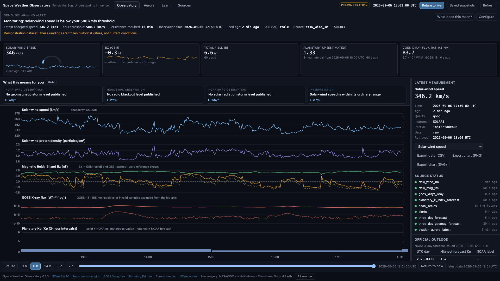
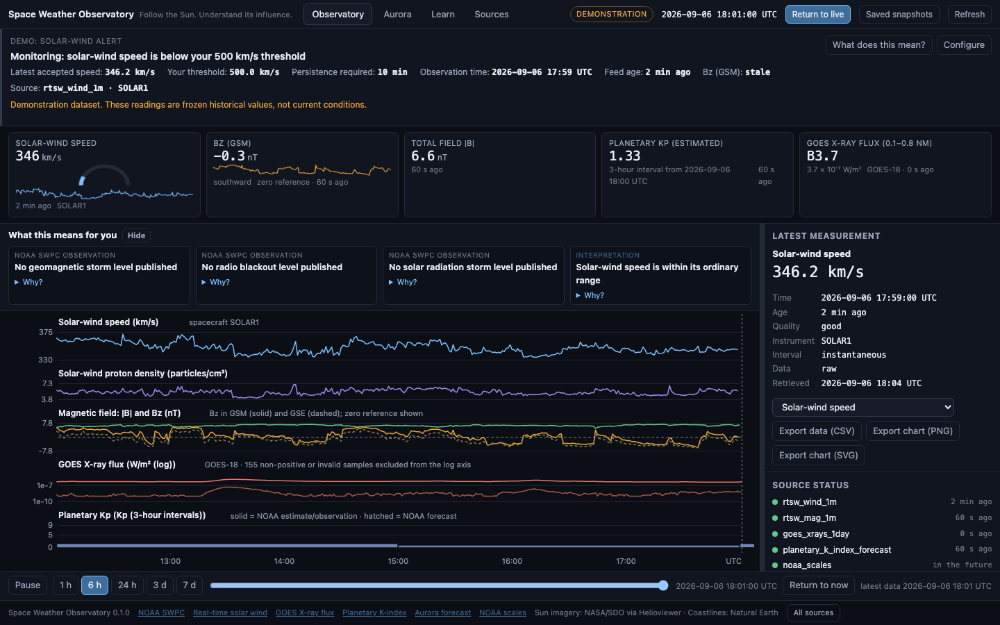
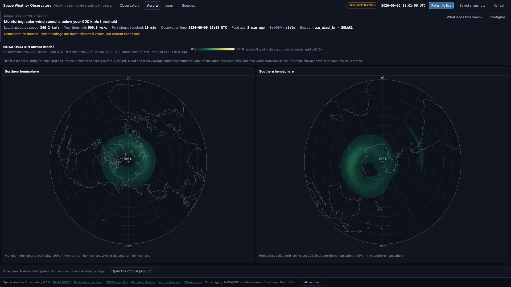
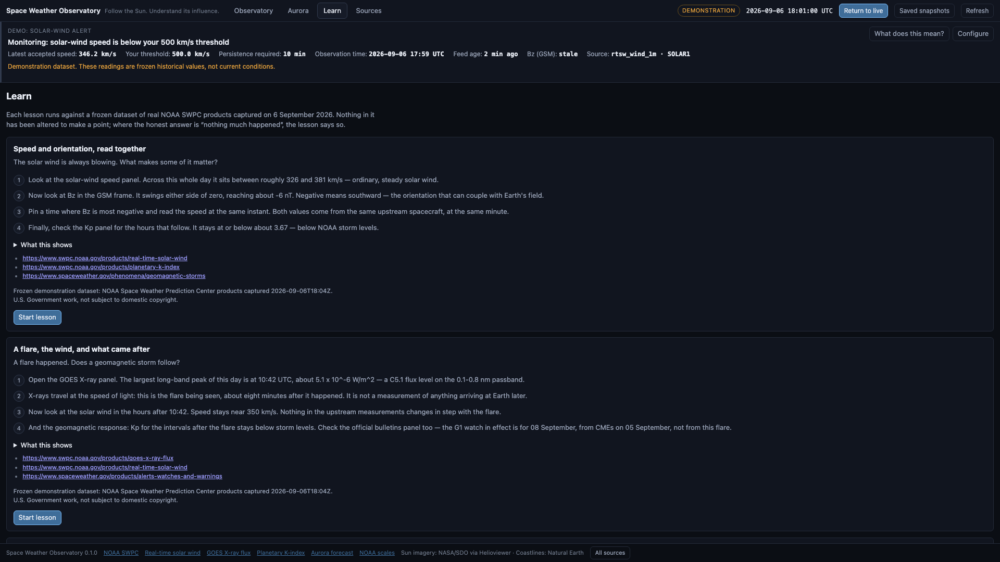
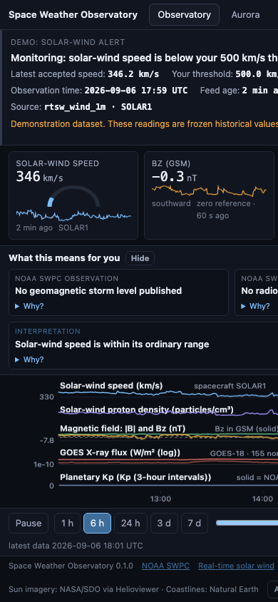

# Space Weather Observatory

**Follow the Sun. Understand its influence.**

A local, source-grounded desktop application for inspecting solar observations, upstream
solar wind, geomagnetic conditions and official NOAA SWPC short-term forecasts — with a
plain-language "What this means for you" layer, a configurable solar-wind alert, an
official-product aurora view, and three lessons over a frozen real dataset.

No account, no cloud, no telemetry, no runtime language model. Every number on screen
carries its provider, instrument, timestamp, quality and source URL.

| | |
|---|---|
| Stack | Rust + Tauri v2 + TypeScript (no framework; small canvas chart engine) |
| Primary target | Windows x64 (NSIS per-user installer). macOS builds for development. |
| Data | NOAA SWPC (`services.swpc.noaa.gov`), NASA SDO via Helioviewer, Natural Earth coastlines |
| Status | **Release candidate on macOS; Windows build configured in CI but not yet run.** See `docs/release-readiness.md`. |

## Screenshots (browser preview of the frozen demonstration dataset)

Browser preview renders the same frozen NOAA dataset the desktop app ships for offline use
and lessons. It is a layout/interaction check, not a desktop or Windows test.

| 1920×1080 | 1440×900 |
|---|---|
|  |  |

| Aurora | Learn | 390 px |
|---|---|---|
|  |  |  |

## Run from source

Prerequisites: Rust (stable), Node 24+, and the Tauri platform prerequisites for your OS
(<https://v2.tauri.app/start/prerequisites/>). No Python.

```bash
npm ci
cargo test --workspace         # 189 deterministic tests, fixture-only, no network
npm test                       # 11 frontend unit tests (Node)
npm run tauri dev              # desktop app with hot reload
npm run tauri build            # installer for the current platform
```

Browser preview only (no backend, frozen dataset): `npm run dev` → <http://localhost:5173/>
(`?view=aurora|learn|sources`). Regenerate its fixtures with `cargo run --bin dump-demo`.

Use **Saved snapshots** to replay retained provider data at a chosen retrieval time. Products
without a retained snapshot at or before that time remain unavailable. **Return to live** exits replay.

Refresh the captured provider originals (network, opt-in): `scripts/capture-fixtures.sh`,
then update the date in `docs/sources.md`.

## Where things live

| Path | Purpose |
|---|---|
| `crates/swo-core/` | Pure scientific core: parsers, model, time alignment, aggregation, flux class, alert state machine, interpretation rules, export. No I/O. |
| `src-tauri/` | Desktop backend: allow-listed acquisition, SQLite cache, snapshot assembly, commands, imagery, demo dataset, lessons. |
| `src/` | Frontend: shell, chart engine, alert banner, aurora, learn, sources. |
| `fixtures/captured/` | Verbatim NOAA originals (2026-09-06T18:04Z) used by tests and as the frozen demo dataset. |
| `docs/` | `sources.md`, `solar-wind-alert.md`, `architecture.md`, `windows-build.md`, `privacy.md`, `license-proposal.md`, `release-readiness.md`, `implementation-status.md`. |
| `.github/workflows/` | `ci.yml` (deterministic tests, lint), `windows-release.yml` (x64 installer + SHA-256). |
| `LICENSE`, `THIRD-PARTY.md`, `CONTRIBUTING.md` | Licence, third-party notices, contribution guide. |

## Configuration reference

`settings.json` in the per-user config directory (macOS `~/Library/Application Support/SpaceWeatherObservatory/`,
Windows `%APPDATA%\SpaceWeatherObservatory\`):

| Key | Default | Notes |
|---|---|---|
| `display_time_zone` | `"UTC"` | IANA name; "tonight" wording needs a known zone. |
| `region_label` | `null` | Free text used only to qualify wording. |
| `alert.*` | see `docs/solar-wind-alert.md` | Threshold 500 km/s, persistence 10 min, hysteresis 25 km/s, clearance 5 min. |
| `cache_limit_mb` | 256 | Enforced on start and after each refresh; last-known-good per product always survives. |
| `snapshot_retention` | 48 | Snapshots kept per product for replay. |
| `force_reduced_motion` | false | OS preference is honoured regardless. |

## Operations notes

- Data locations are per-user; the install folder holds no data. Uninstall retains data
  (`docs/windows-build.md` describes removal).
- One failed product degrades its own panel only; last-known-good is kept and marked stale.
- Offline launch shows cached data with per-product freshness. Backoff is exponential and
  capped at 30 minutes so an offline machine is not hammered.
- Closing the window stops all polling; there is no tray, notification or background service.

## Licence

MIT — see `LICENSE`. Third-party notices: `THIRD-PARTY.md`.
